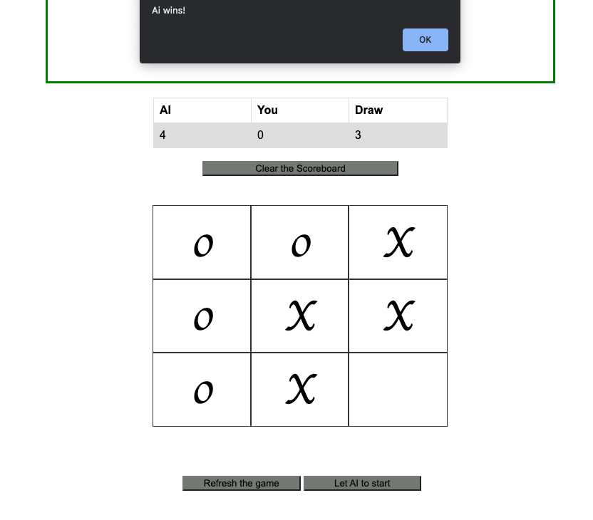

# Web based tic-tac-toe game against AI

Tic-tac-toe(X's and O's) is a paper-pencil game. Two players (X , O) try to put their marks in horizontal, vertical and diagonal. 
The first player who manages to put three marks in a proper order, wins. The first evidence of the game comes from 1300 BCE. Maybe more than
3000 years this game is played between two players and now, it is time to change the players. In this web application, you will play agains the
AI which is learned the MiniMax algorithm.

MiniMax algorithm is a search algorithm like Depth-First Search or Breadth-First Search. MiniMax is basically used for decision making and to find the
best move for player. This algorithm can also be used for Chess, because it has a similar feature with Tic-tac-toe, they are both turn based games. However,
it is not very efficient to directly use this algorithm for Chess, because there will be lots lots of movement for AI to compute. Anyway, lets go dive into
the steps of the algorithm.

In MiniMax algorithm, the first player tries to pick the lowest score, we called this player min player and the other player tries to pick the highest value whose
is max player.

1) Starts with the root node

2) Calculate the evaluation function for every node

3) Go back from leaves to root : 

-> for max player, choose the highest val
-> for min player, choose the lowest val

4) When come to root node, choose the max value which will be our next move. 

